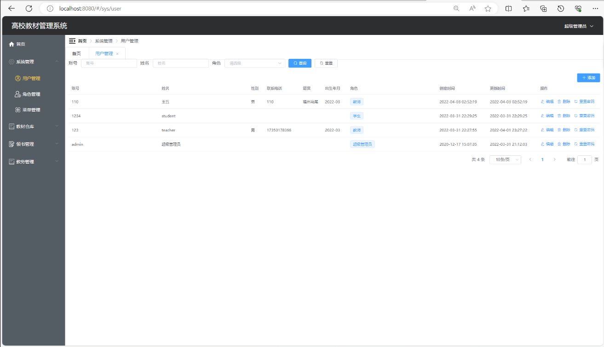
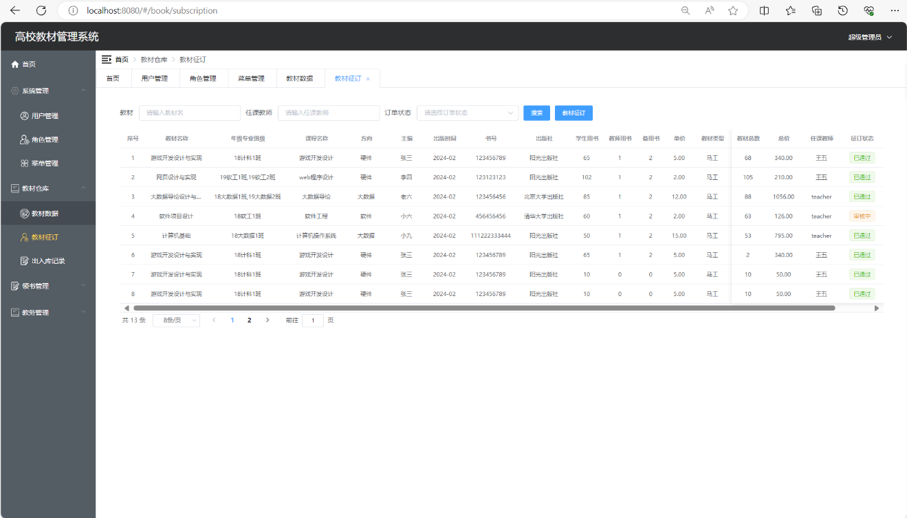
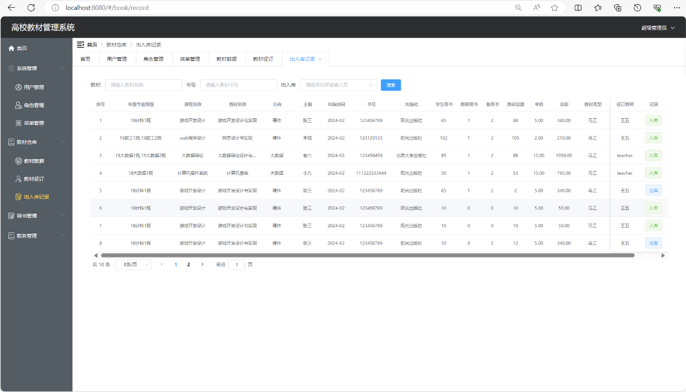
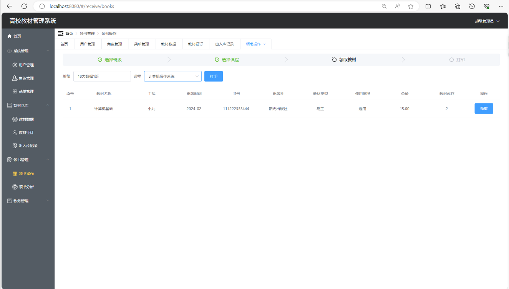
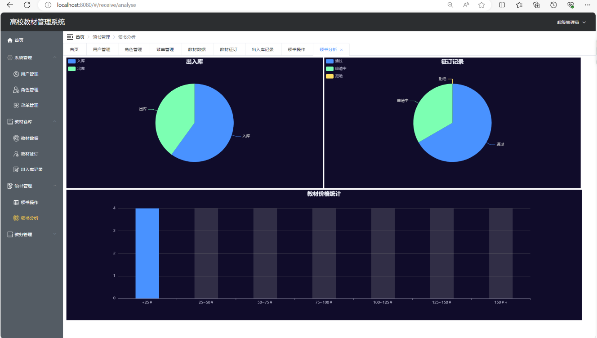
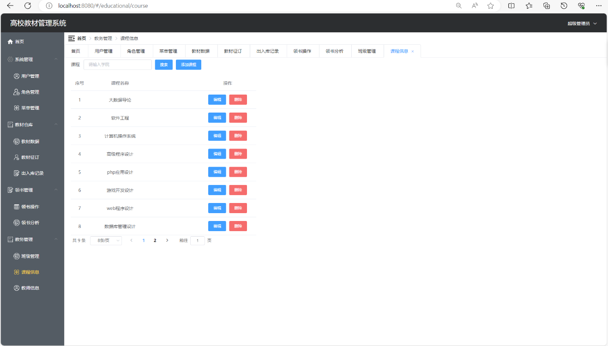

# 基于nodejs的教材管理系统

### 9.9￥ 获取完整源码+sql，需要加Q：3577148218 ,微信: qszard26
### 有问题，或者需要协助调试运行项目的也可联系
### 获取更多项目，关注公众号：编程项目集

## 一、介绍

1、项目介绍

基于nodejs前后端分离的教材管理系统

三个角色：管理员、教师、学生

用户管理、角色管理、菜单管理、教材数据、教材征订、出入库记录、领书操作、领书分析、班级管理、课程信息、教师信息

## 二、软件架构

语言：nodejs

框架：Egg.js、Vue

数据库：MySQL

3、开发环境

node版本：12.12.0

运行工具：vscode

## 三、系统部分功能页面展示

### 9.9￥ 获取完整源码+sql，需要加Q：3577148218 ,微信: qszard26
### 有问题，或者需要协助调试运行项目的也可联系

